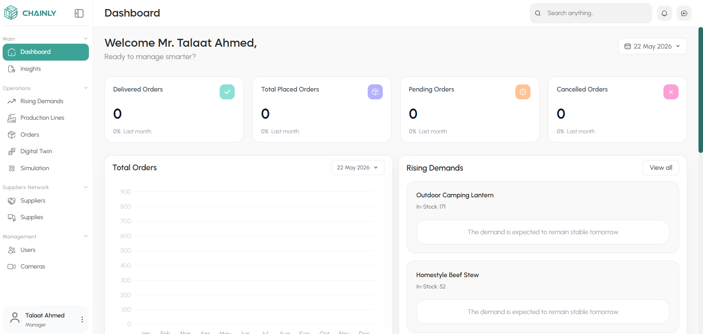
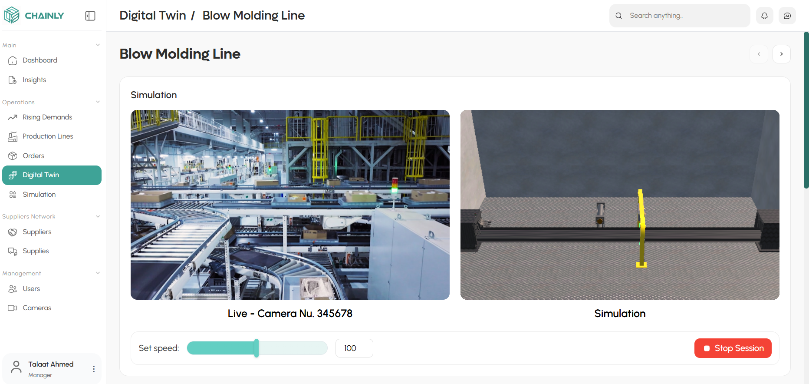
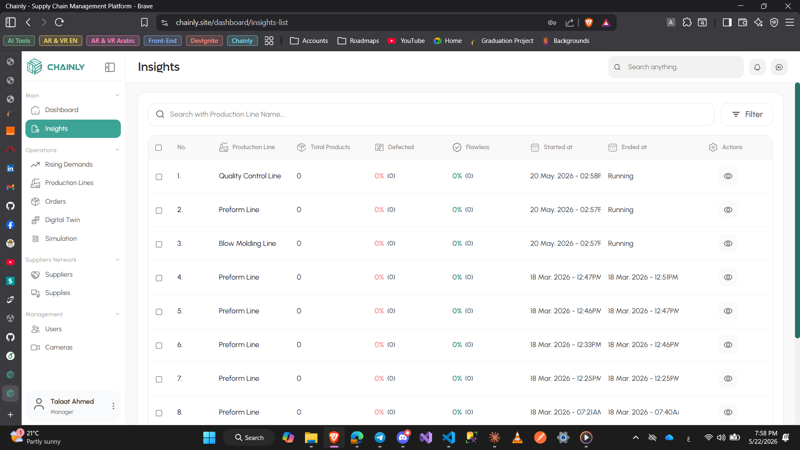
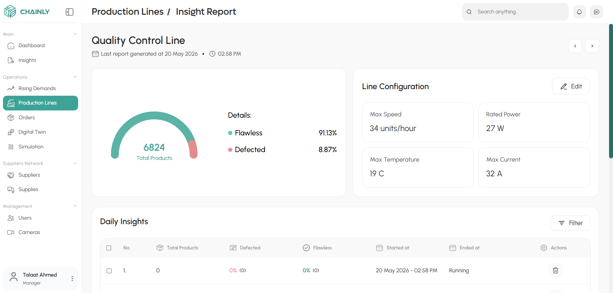
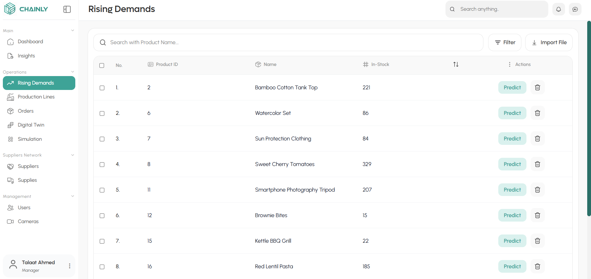
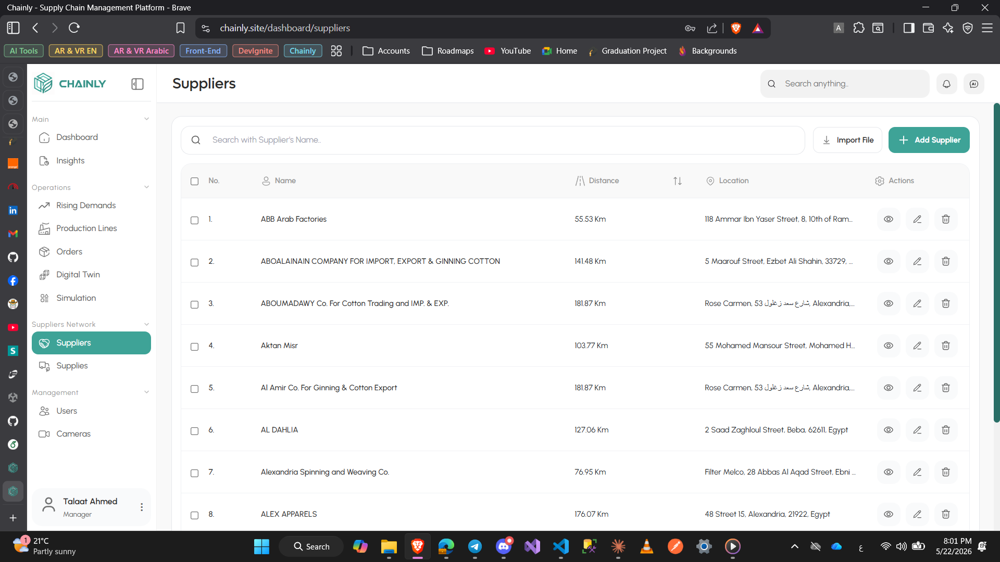

# Chainly - Supply Chain Management Platform

Chainly is an AI-powered Supply Chain Management platform designed to help manufacturers optimize operations, improve product quality, and make smarter production decisions using modern technologies such as Computer Vision, Digital Twin simulation, and Demand Forecasting.

🌐 Live Demo: https://www.chainly.site/

---

# Features

## AI-Powered Demand Forecasting
Predicts future product demand to help manufacturers:
- Balance supply and inventory
- Reduce waste
- Optimize production resources
- Improve planning efficiency

---

## Digital Twin Simulation
Real-time digital simulation of production lines that enables manufacturers to:
- Test production decisions safely before implementation
- Monitor production behavior in real time
- Simulate factory environments digitally

### Includes:
- Real-time synchronization
- Interactive dashboards
- Live monitoring system

---

## Computer Vision Quality Assurance
Automated quality monitoring system using Computer Vision to:
- Detect production defects
- Improve product quality
- Reduce downtime
- Increase manufacturing efficiency

---

## Supplier Recommendation System
AI-based supplier recommendation feature that helps companies select suppliers based on:
- Supplier performance
- Sustainability metrics
- Carbon footprint scoring

---

## Dashboards & Analytics
Interactive dashboards and analytics for:
- Production monitoring
- Demand analysis
- Inventory tracking
- Operational insights

---

## Authentication & Security
- Authentication & Authorization
- Role-based access control
- Protected APIs
- Secure user management

---

# Tech Stack

## Frontend
- Angular
- TypeScript
- SCSS

## Backend
- ASP.NET Core Web API
- Entity Framework Core

## Database
- SQL Server

## Other Technologies
- Firebase
- Leaflet Maps
- Computer Vision
- AI/ML Models
- Real-time Communication
- Digital Twin Simulation

---

# My Contribution

Worked on the frontend development using Angular, including:
- Building responsive UI components
- Developing dashboards and pages
- Integrating frontend with backend APIs
- Enhancing user experience and application flow
- Implementing authentication flows and route handling
- Integrating Unity simulation into the web platform
- Implementing real-time Digital Twin visualization where moving objects on the production line are synchronized and displayed live inside the Unity simulation on the website

---

# Project Structure

```text
CHAINLY_WEB/
│
├── public/                         # Static assets
│   ├── fonts/
│   ├── icons/
│   ├── images/
│   ├── leaflet/
│   └── unity/
│
├── src/
│   ├── app/
│   │
│   ├── core/                       # Core application logic
│   │   ├── guards/
│   │   ├── interceptors/
│   │   └── services/
│   │
│   ├── features/                   # Feature modules
│   │   ├── auth/
│   │   ├── dashboard/
│   │   ├── digital-twin/
│   │   ├── insights/
│   │   ├── cameras/
│   │   ├── landing/
│   │   ├── orders/
│   │   ├── production-lines/
│   │   ├── rising-demands/
│   │   ├── simulation/
│   │   ├── suppliers/
│   │   ├── supplies/
│   │   └── users/
│   │
│   ├── shared/                     # Shared reusable components
│   │   ├── components/
│   │   └── map-picker/
│   │
│   ├── app.routes.ts
│   ├── app.config.ts
│   └── firebase.config.ts
│
├── angular.json
├── package.json
└── README.md
```

---

# Screenshots

## Dashboard


---

## Digital Twin


---

## Insights


---

## Insights Report


---

## Rising Demand


---

## Suppliers


---

# Installation

## Clone the repository

```bash
git clone https://github.com/shahdyassin/Chainly.git
```

---

## Navigate to the project

```bash
cd Chainly
```

---

## Install dependencies

```bash
npm install
```

---

## Run the application

```bash
ng serve
```

The application will run on:

```text
http://localhost:4200
```
